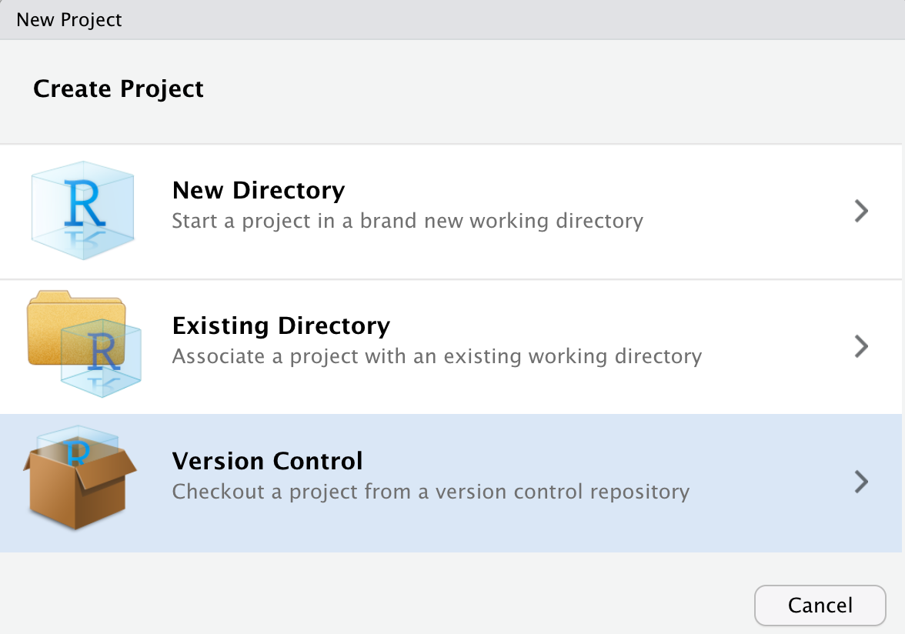
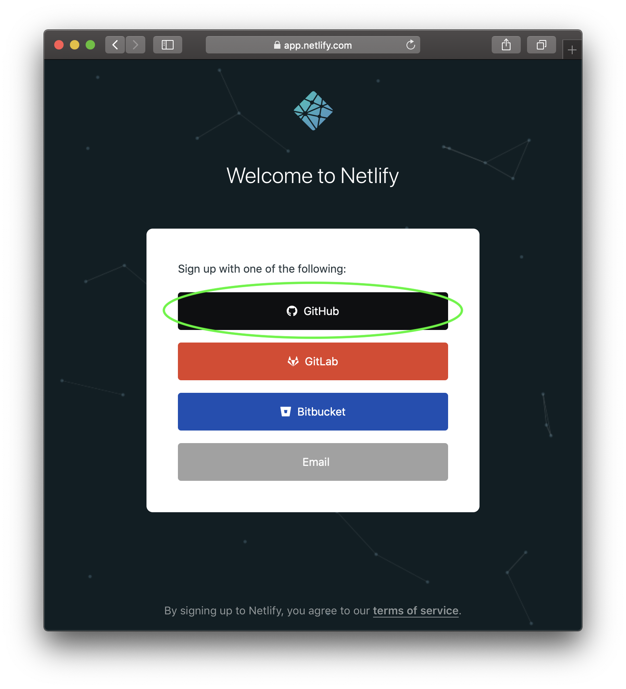
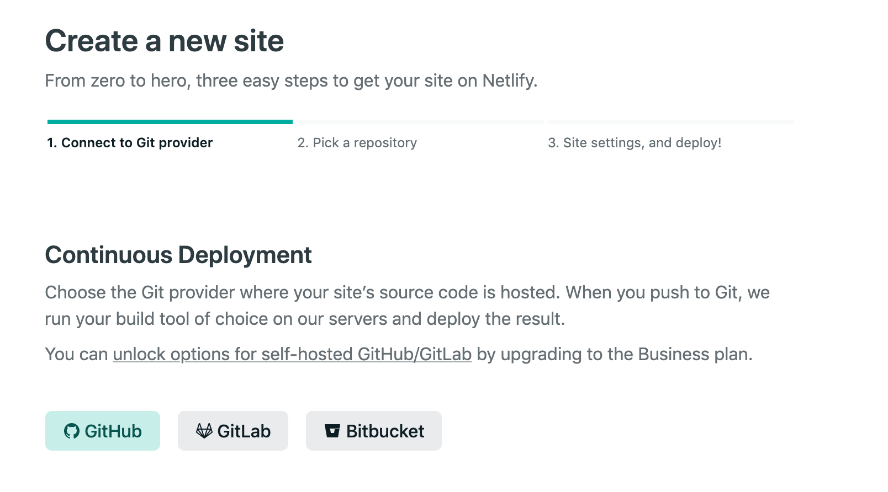

```{r setup, include=FALSE}
knitr::opts_chunk$set(message = F)
```

## Hello! 

#### Find me at...

`r icons::fontawesome("twitter")` @hidyverse
`r icons::fontawesome("github")` @heidiesteiner
`r icons::fontawesome("link")` heidiesteiner.netlify.app
`r icons::fontawesome("paper-plane")` heidiesteiner@email.arizona.edu


#### About me.... 

- PhD Student, Clinical Translational Sciences Program

- I enjoy plants, biking and data analysis in the tidyverse 

- Not an expert


---
## Step 1 

Make a repo on Github

NO `README` + NO `.gitignore` (yet!)

 
---
## Step 2

Make a new RStudio project via git clone

    *File > New Project > Version Control > Git*
    
```{r out.width="75%", echo = FALSE}

```

---
## Step 3 

1x per machine...
```{r eval = FALSE}
install.packages("blogdown")
```


1x per work session...

```{r eval = F}
library(blogdown)
```


1x per project...
```{r eval = FALSE}
new_site(theme = "gcushen/hugo-academic", 
         sample = TRUE, 
         theme_example = TRUE, 
         empty_dirs = TRUE,
         to_yaml = TRUE)
```

**NOTE:** Serve the site 

---
## Step 4 

Check your Hugo version and the version required by the theme you chose (academic = 0.55)
```{r eval = F}
hugo_version()
```

If your Hugo version is less than required 
```{r eval = F}
blogdown::install_hugo(force = T)
```

Then **restart** R. 

---
## Step 5

Sign up to Netlify using your GitHub account.

```{r out.width="75%", echo = FALSE}

```


---
## Step 6

```{r eval = F}
file.create("netlify.toml")
```

Then open it and copy and paste: 

```{r eval = F}
[build]
  publish = "public"
  command = "hugo"
[context.production.environment]
  HUGO_VERSION = "0.83.1"
  HUGO_ENV = "production"
  HUGO_ENABLEGITINFO = "true"
[context.branch-deploy.environment]
  HUGO_VERSION = "0.83.1"
[context.deploy-preview.environment]
  HUGO_VERSION = "0.83.1"
```

**NOTE:** make sure Hugo version matches yours! 

---
## Step 7 

Commit and push to GitHub!


---
## Step 8

Update .gitignore file
```{r eval = F}
.Rproj.user
.Rhistory
.RData
.Ruserdata
public/
.DS_Store # if a windows user, Thumbs.db instead
```

---
## Step 9 

Link to GitHub in Netlify 



---
## Step 10 

Personalize/add content to your heart's content! 

#### JK

This step is like 450 steps in one 


